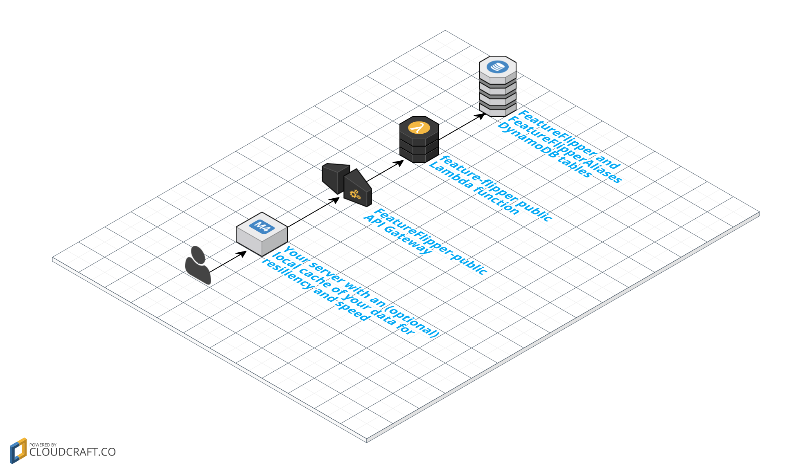

Feature Flipper
===============

About
-----

This is a feature flipper which is used to incrementally roll out features
across services and environments.

What makes this feature flipper different from some of the others out there is
that it's exposed as a HTTP service, not a particular language or runtime. SDK
generation is available via the API Gateway console.

The backend is serverless, running on AWS Lambda and API Gateway with DynamoDB
for persistence. The front end is a single page application (SPA) hosted on S3.

Once some static resources are setup, the SPA frontend and API backend are
easily deployed and upgraded with a single command.

### Motivation

This isn't the place for discussing the merits of continuous delivery or why we
think it's useful to deliver software using this tool.

Suffice it to say as a team and product scales and you have
- Managers that want to control what features are released and when
- QE engineers that want to test features before they're released
- Complex application and infrastructure architectures
- A particular feature spanning multiple teams in different time zones

It's really nice to not be in the critical path of releasing software by having
to either (1) be responsible for merging feature branches or (2) build
automation to avoid (1).

The key benefit of a feature flipper is that it separates the physical release
of software from the logical release of software.

### Concepts

A channel is an `{environment}-{service}` tuple (e.g.`PROD-BlogService`)

A channel has feature sets.

Feature sets have features.

Features have a description and percentage of users that can see them.

### Architecture

#### Consuming server (public)

#### Admin interface (private)

### Documentation

- [Getting started and deployment](docs/deployment.md)
- [Client API](docs/client-api.md)
